## 관통프로젝트 (2019.04.26)

### 팀원 : 박주성, 전건욱

#### 1. 데이터베이스 구축
- DB 모델링 및 생성
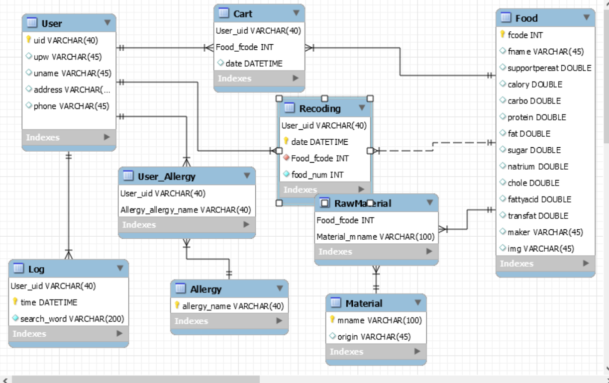

#### 2. 회원 관리
- 회원가입 / 회원탈퇴 / 회원정보수정
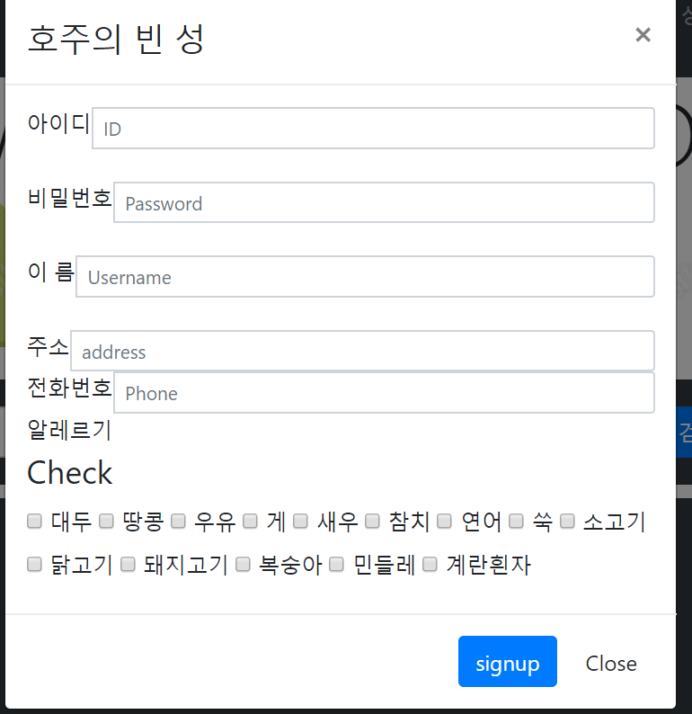
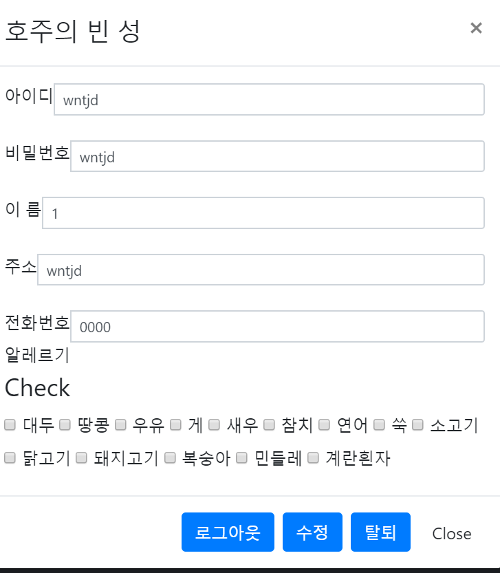

#### 3. 로그인 관리
- 로그인 / 로그아웃
- admin 계정일 시 db구축 가능
- 비밀번호 분실 시 아이디와 전화번호로 비밀번호 변경 가능

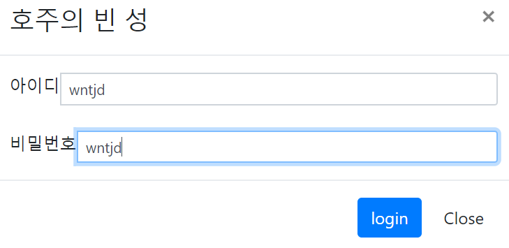
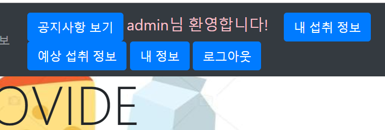
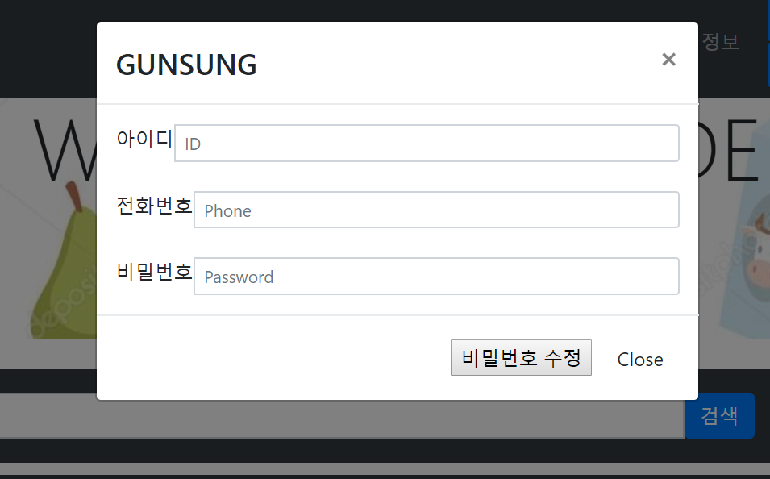

#### 4. 식품 검색
- 전체검색 / 식품명 검색 / 제조사 검색 / 원재료 검색
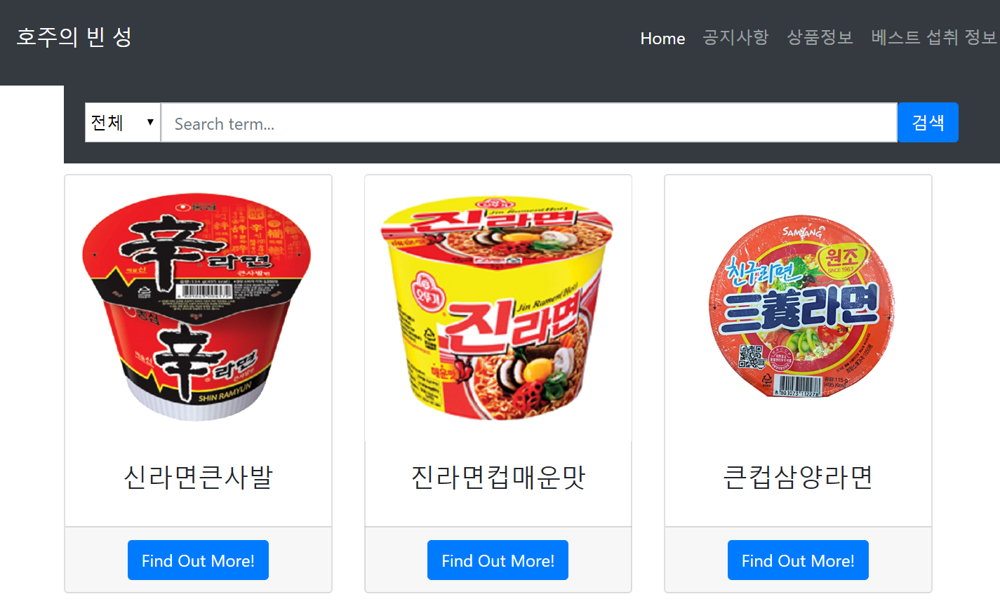

#### 5. 식품 상세 정보
- 식품 상세보기
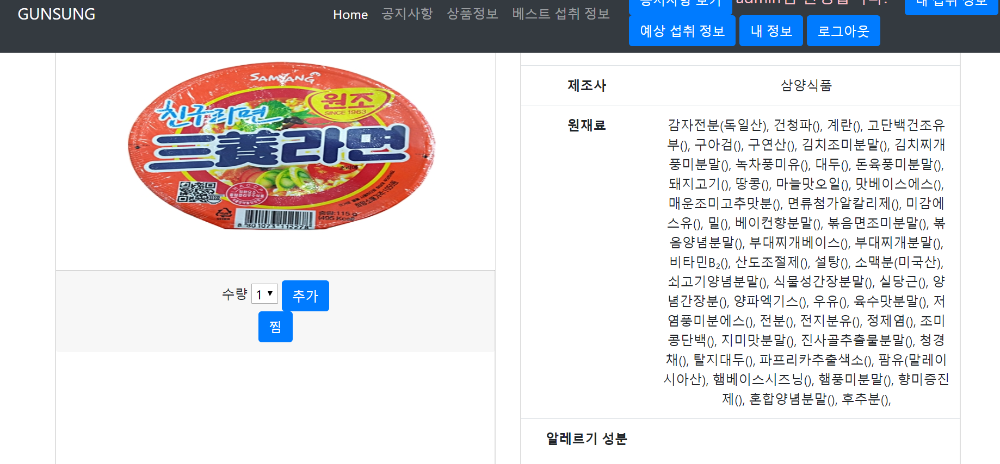

#### 6. 섭취 식품 저장
- 섭취 식품 테이블 관리
- 날짜 / 먹은 음식 / 수량
- 섭취 식품 삭제 가능

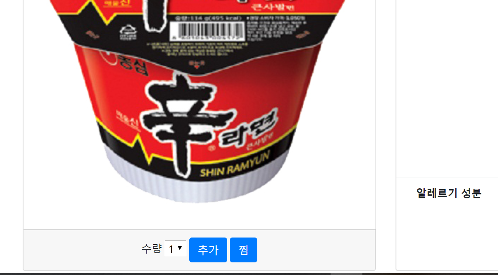
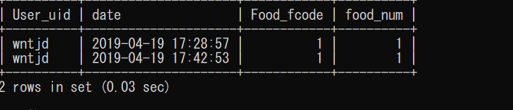
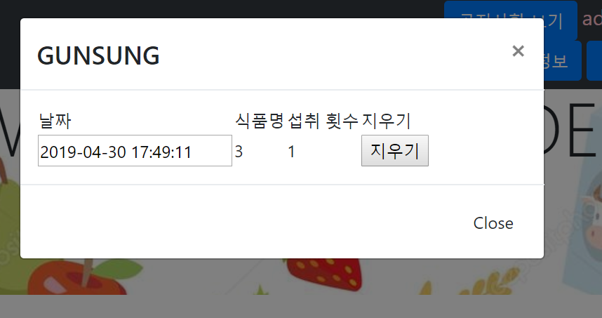

#### 7. 공지사항
- 공지사항 작성 및 보기 / 수정

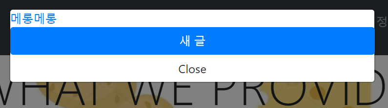
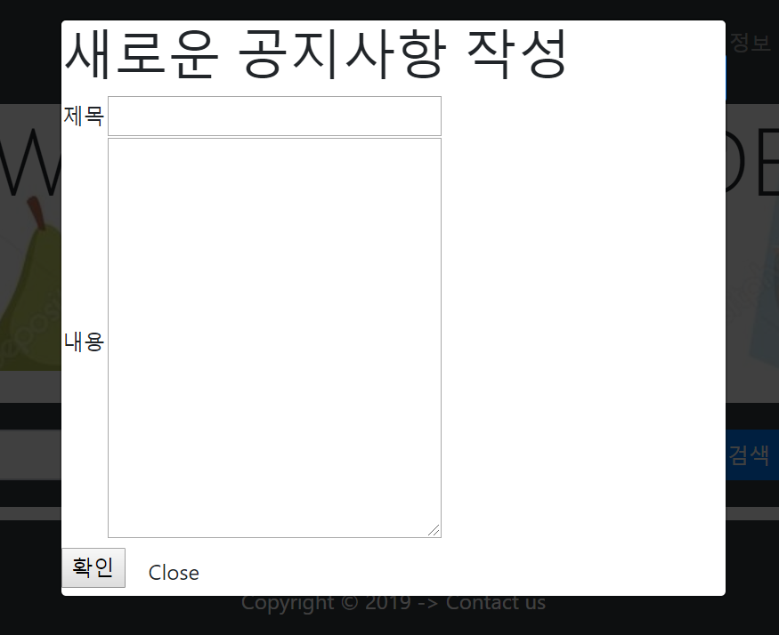

#### 8. Q&A 게시판
- Q&A 목록보기

- Q&A 상세보기

- Q&A 작성 (진행중)

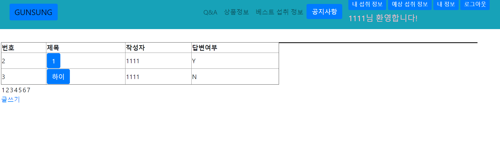
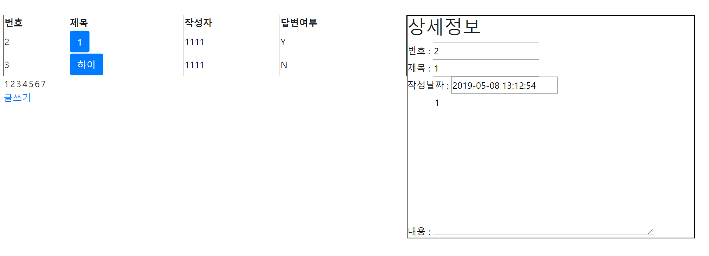
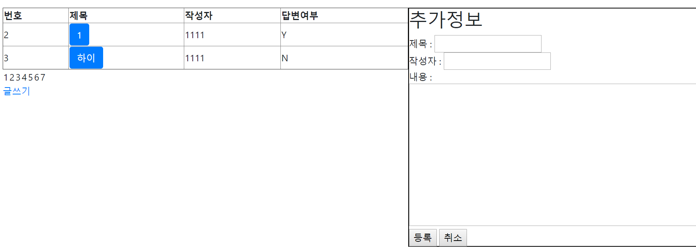
